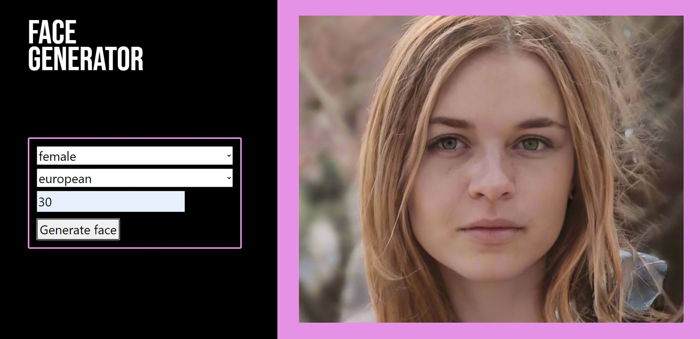

# Face Generator

A simple project allowing to generate a random face image based on provided parameters such as gender, age, and ethnicity.

## Screenshots



## Description

This project enables the user to generate a random face image based on selected parameters. The user can choose gender, age, and ethnicity, and then generate the corresponding face image.

## Technologies

- HTML
- CSS
- JavaScript

## Usage

To use the project, open the `index.html` file in a web browser. Then select the appropriate parameters using the form and click the "Generate face" button. The generated face image will appear below the form.

## JavaScript Script

```javascript
document.querySelector('#form').addEventListener('submit', getFace);

async function getFace(event) {
    event.preventDefault();

    const gender = document.querySelector('#gender').value;
    const age = document.querySelector('#age').value;
    const ethnicity = document.querySelector('#ethnicity').value;

    const url = `https://face-studio.p.rapidapi.com/generate?gender=${gender}&age=${age}&ethnicity=${ethnicity}`;
    const options = {
        method: 'GET',
        headers: {
            'X-RapidAPI-Key': '80be03a6d4msh3de92304a92c4d4p1a3a32jsn601cbf465564',
            'X-RapidAPI-Host': 'face-studio.p.rapidapi.com'
        }
    };

    try {
        const response = await fetch(url, options);
        const result = await response.blob();
        const image = URL.createObjectURL(result);

        const existingImage = document.querySelector('#image-container img');
        if (existingImage) {
            existingImage.parentNode.removeChild(existingImage);
        }

        const imageElement = document.createElement('img');
        imageElement.src = image;
        document.querySelector('#image-container').appendChild(imageElement);
    } catch (error) {
        console.error(error);
    }
}
